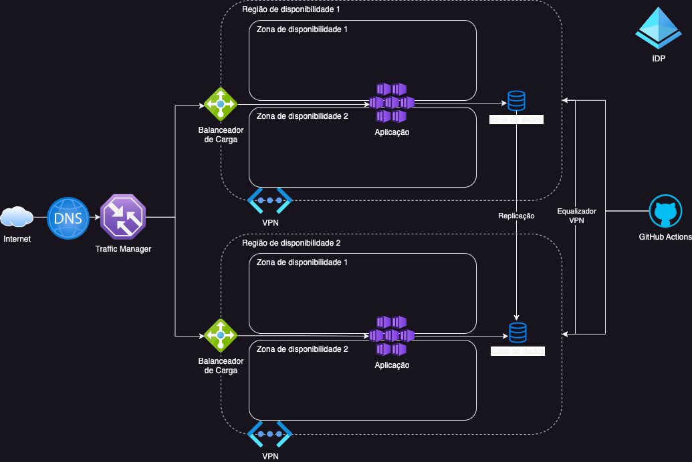

# cashflow

**Fluxo de caixa de alta disponibilidade**

# Aspectos gerais

Na imagem

é definido o esquema arquitetural em nuvem para o deployment desse produto;

Foi considerado para tanto o requisito não funcional ==> Alta disponibilidade: a principal definição que conduz essa arquitetura para ter alta disponibilidade está ligado à distribuição em pelo menos duas regiões de complemento de disponibilidade e também ter a replicação de dados de modo a manter bases de dados nas duas regiões respondendo às diversas instancias de Kubernets (pods) garantindo assim a independência entre os clusters nas regiões.

## Considerações do código da solução

No desenvolvimento da aplicação, tendo em vista isso ser parte de uma aplicação complexa (Financeiro/Contabilidade) e poder no futuro evolir para um subsistema, a decisão foi adodar um estilo arquitetural em camadas baseado em Clean Architecture, conjugado com o padrão DDD (Domain Driven Design).

# Tomadas de decisão

Nessa secção estão comentadas alguma tomadas de decisão que foram feitas durante a implementação do projeto.

# Instruções de operação

# Execução da aplicação

Navegue até a pasta raiz da solução, onde estão os arquivos Dockerfile e docker-compose.yml e execute o comando na linha de comandos:

    > docker compose up

Em seguida abra um browser de sua preferencia (Foi completamente testado usando o Chrome e Safari) e acesse à seguinte url:

[Url da aplicação](http://localhost:5136/swagger/index.html)

Isso o colocará na pagina principal da documentação Swagger da aplicação

## Login

Ao executar a aplicação, o sistema irá criar automaticamente a base de dados e abrir uma página na documentação swagger da aplicação, onde podem ser executados todos os endpoints da mesma. Lembrando que a aplicação foi desenvovida utiilzando processo de autenticação. Sendo assim é necessário ir ao endpoint de login POST /api/home/login e preencher os dados de um dos dois usuários que foram "Mocados":

- username: cashusr1 password: 123@

- username: cashusr2 password: 456@

## Operações de fluxo de caixa

Após isso é possivel copiar o token gerado na resposta da requisição e fazer a autenticação do Swagger (clicar no botão Autorize) e seguir as instruções lá expostas.

Consequentemente será possível cosumir os outros endpoints:
- GET /api/billings-to-pay --> consultar todas as contas a pagar;
- 
- GET /api/billings-to-pay/{id} --> consultar uma certa conta a pagar pelo código;

- PUT /api/billings-to-pay --> realizar a baixa do título

- POST /api/billings-top-pay --> inserir uma nova conta a pagar;

- DELETE /api/billings-to-pay/{id} --> deleta um registro de conta a pagar identificada pelo id;

- GET /api/billings-to-receive --> consultar todas as contas a receber;
- 
- GET /api/billings-to-receive/{id} --> consultar uma certa conta a receber pelo código;

- PUT /api/billings-to-receive --> realizar a baixa do título

- POST /api/billings-to-receive --> inserir uma nova conta a receber;

- DELETE /api/billings-to-receive/{id} --> deleta um registro de conta a pagar identificada pelo id;

- GET /api/cashflows/consolidate --> consolidar as contas de uma certa data (nesse caso apenas um dia);

# Observabilidade

Foi configurado o meddleware do Serilog para gerar logs struturados cujo teor tem como objetivo possibilitar a auditoria das ações realizadas no sistema pelos usuários;

# Orientações para Evolução do Projeto

Em caso de alterações nas entidades de domínio, é necessário rodar o comando de migrações para que possa atualizar o modelo de dados no sistema de gerenciamento de dados. Segue abaixo o comando com suas especificações devido a complexidade da arquitetura do produto:

- Para incluir uma nova migração, digigar na linha de comando do terminal, na pasta raiz do projeto /src o seguinte comando:

  dotnet ef migrations add <migration-name> --project CashFlow.Data --startup-project CashFlow.WebAPI

- Para excluir a última migração:

  dotnet ef migrations remove <migration-name> --project CashFlow.Data --startup-project CashFlow.WebAPI
